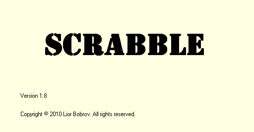

**Scrabble**

**Scrabble game - written in C\# WinForms**

Notice: all additional files - Interop.SpeechLib.dll**,** RightArrow.bmp and

DownArrow.bmp MUST be located in the executable folder (where Scrabble.exe file
is located):

When launching the application, the splash screen is shown:

After few seconds, Options window is shown:

On this screen, we can:

-   Change max. number of letters that the user can have at a time (2 to 15)

-   Hover the mouse over a letter-\> letter's value is shown

-   Click on a letter-\> we can change its value, or select random value for it.

To change the value manually, type a new value (1 to 9999), then press Enter:

We can change the value of one or more letters, or select random value for them
(the new random value will be between 1 and 9999).

When ready, press "OK" button-\> the main application screen will be shown.

Selecting Max. letters= 15 from Options screen and press "OK"-\> the main screen
is shown as follows:

Now, we can:

-   Drag&Drop a word letter-by-letter, from letters surface, to the board.

The first word must occupy the center of the board.

Press "**Submit**" button-\> the word will be displayed, along with its score.

-   If we can't create a legal word from the given letters:

Press "**Pass**" button-\> Pass window will be shown.

From here, we can replace the letters we want, by click on them

(or check the "Select All" checkbox) and press "Pass" button:

-   Instead of creating the first word manually, we can press the button

"**First Word Hint**" from the main screen.

The application finds the best result(s) for legal word, using the given
letters.

(More than one word can be suggested here)

Now, we can select a suggested word, by double-click on the suggestion-\>

the first move is now done.

-   Wild card: a wild is displayed as a white button without a letter on it

(as shown on the screenshot above).

Dragging it to the board, on the square we want-\> Wild card window will be
shown:

Now, we can select the new letter, either by pressing the wild letter combobox,
or by typing the letter using the keyboard.

Press "OK" button-\> the wild card window will be closed and the wild card will
have the new letter on it. Such wild card letter's value is 0.

-   Playing using the keyboard (instead of mouse Drag&Drop):

click on a square on the board, then press right or down arrow on keyboard-\>

this sets the word's typing direction (right arrow for horizontal, down arrow
for vertical).

In the screenshot below, we can now type a word, which will be shown vertically:

Additional game options buttons:

Toggles "Speak Legal Words" ON/OFF.

Changes the board's background color, according to user's choice.

For example, after changing board's background color to green, the

main screen will look like that:

Switches between circle/rectangle bonus shape.

Rectangular bonus squares will look like that:

Sorts the letters on letters surface, by ascending/descending order.

Shuffles the letters on letters surface.

Shows the previous move played on board (disabled before first move).

Shows the next move played on board (disabled after last move).

Shows letters values, according to what we set on Options window

(before main screen is shown), or according to default values (if letters

values were not set on Options window):

On the next page of this manual, there is a short description of the application
code.

**Code Components**

**frmScrabble.cs:** Here we have application's main code, including calls to
board initialization and communicating with other windows, depending on user's
actions.

<https://github.com/LiorBob/Scrabble/blob/master/Scrabble/frmScrabble.cs>

**frmScrabble.Designer.cs:** Actual board initialization, including buttons
letters surface, the board itself including bonus squares, as well as Drag&Drop
logic.

<https://github.com/LiorBob/Scrabble/blob/master/Scrabble/frmScrabble.Designer.cs>

**frmSplash.cs** and its designer: The splash screen, after launching the
application.

<https://github.com/LiorBob/Scrabble/blob/master/Scrabble/frmSplash.cs>

**frmOptions.cs** and its designer: Deals with Options window (after splash
screen).

<https://github.com/LiorBob/Scrabble/blob/master/Scrabble/frmOptions.cs>

**frmPass.cs:** Deals with "Pass" window, where user selects which letters to
replace.

<https://github.com/LiorBob/Scrabble/blob/master/Scrabble/frmPass.cs>

**frmWildCard:** Represents Wild card window, shown after Drag&Drop of a wild
card.

<https://github.com/LiorBob/Scrabble/blob/master/Scrabble/frmWildCard.cs>

Other parts of the code deal with:

Single letter representation, moves representation and First Word Hint logic.

This is described on the next page.

**Letter.cs:** Represents a single letter, with its properties and methods for
retrieving

its color and points (value).

<https://github.com/LiorBob/Scrabble/blob/master/Scrabble/Letter.cs>

**FirstMove.cs:** This class holds the first move logic, including various
validations of the word just put on board.

<https://github.com/LiorBob/Scrabble/blob/master/Scrabble/FirstMove.cs>

**NonFirstMove.cs:** This class holds the logic of all moves, except the first.

Here, there are additional validations, including combinations with other,
already-existing words that were put on board.

<https://github.com/LiorBob/Scrabble/blob/master/Scrabble/NonFirstMove.cs>

**FirstWordHint.cs:** This class produces the first word hint (from the list of
legal words) and shows it to the user.

<https://github.com/LiorBob/Scrabble/blob/master/Scrabble/FirstWordHint.cs>

**YouTube demo:**

<http://www.youtube.com/watch?v=ZBqmSGUKgB0>
